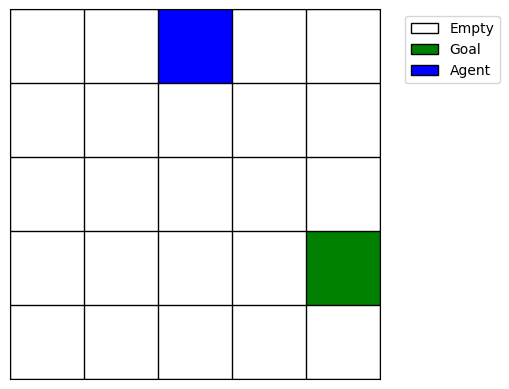
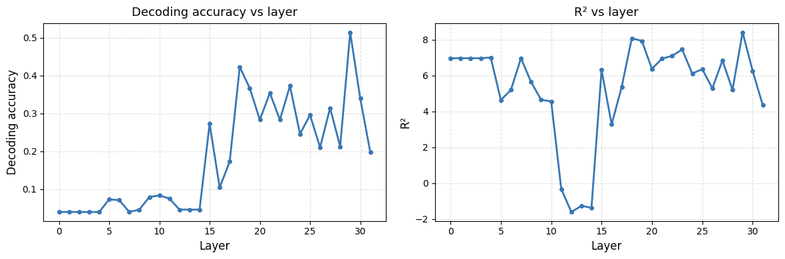
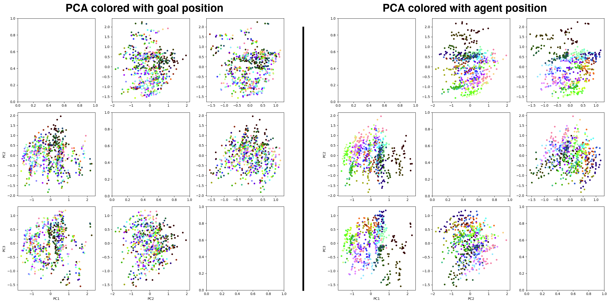
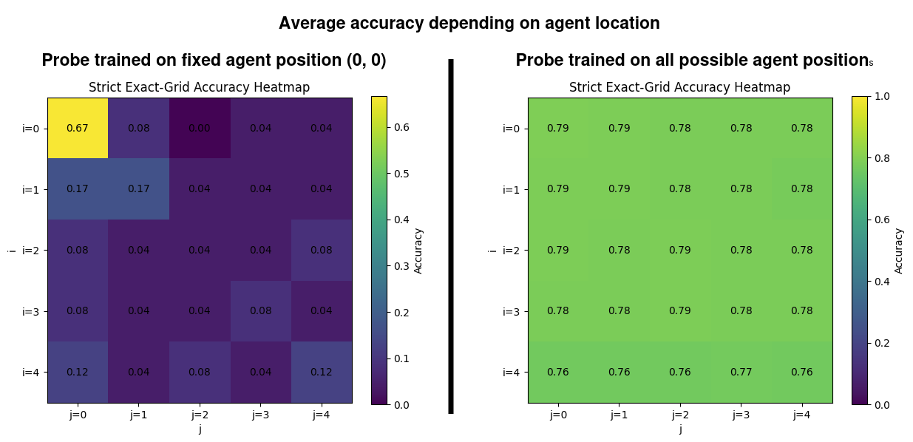
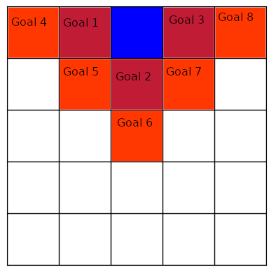
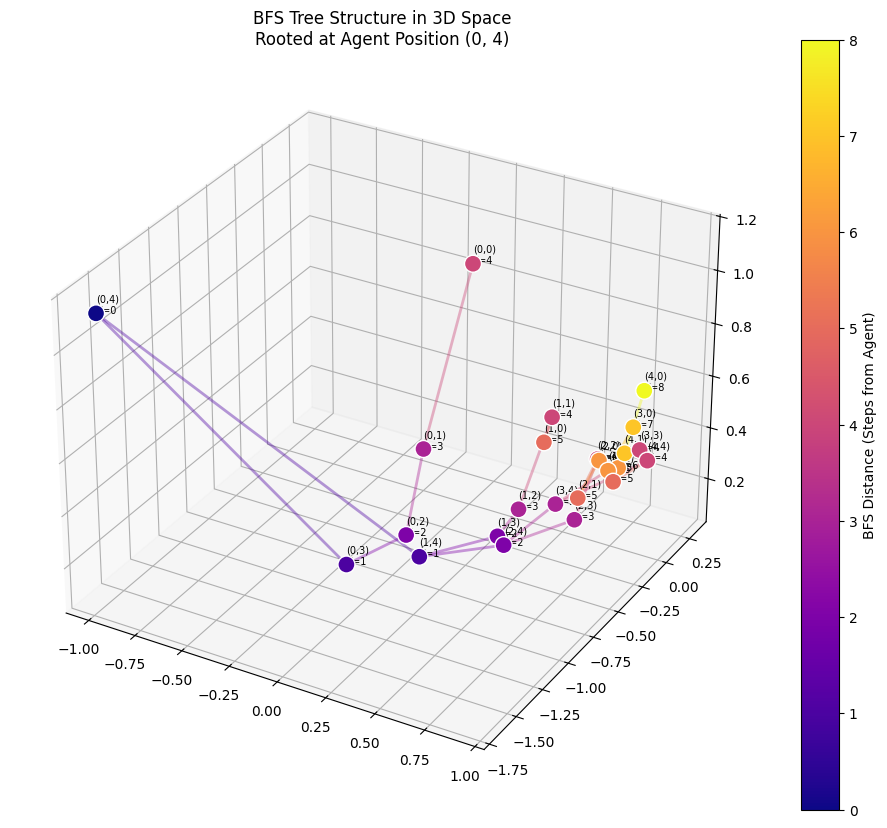
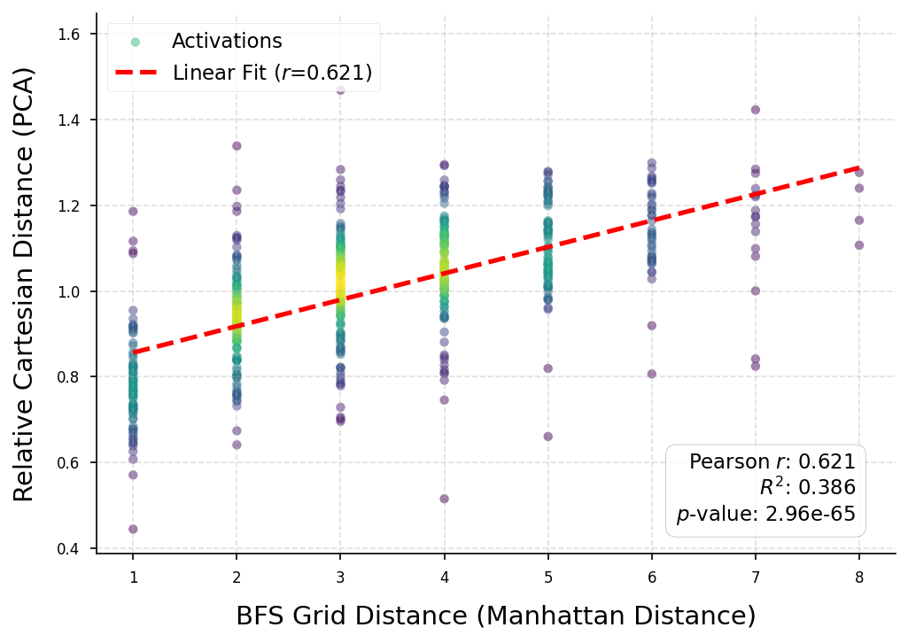
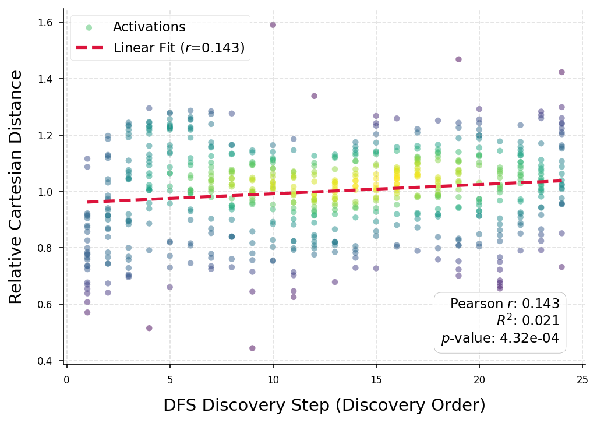

# How LLMs Encode Grid Goals: Evidence for Agent-Centric Breadth-First Search

## Introduction

### Background

I am a **postdoctoral** researcher in ML, and before that my first training was as a computer science engineer. This blog post is intended as a way for me to get my hands dirty and dive into mechanistic interpretability concretely for the first time, after finishing my Technical AI Safety certification from Blue Dot.

### Motivations

Understanding the goals of Large Language Models is a fundamental challenge for AI safety. Spatial goals provide an easy, toy challenge to start tackling this problem, as the location, distance, and direction of the goal can easily be measured.

The primary inspiration for this work is the following paper: [From Text to Space: Mapping Abstract Spatial Models in LLMs during a Grid-World Navigation Task](https://arxiv.org/html/2502.16690v1#S6) [1].

They focus heavily on the LLM’s representation of the agent in the grid, and not on interpreting the representation of the goal. This work aims to push this line of inquiry further by specifically investigating how goals themselves are represented internally by the model.

## Executive Summary

> ❓ **Research Questions**
> This work set out to answer the following questions:
>
> 1. Do LLMs represent goals in a way that can be extracted?
> 2. What can we learn about this goal representation?

Thus, the study aimed to learn information about the representation of spatial goals in an LLM using the following tools:

* **MODEL**: Inspired by [1], I use LLaMA-3.1-8B throughout the experiment.
* **DATASET**: I generated a very simple dataset of instructions and locations on a 5×5 grid.
* **METHODS**: (1) A linear classifier was used to reconstruct the grid from model activations; (2) PCA was then applied to the relevant activations to learn more about their structure.

## Key Results

1. We find that the network represents goals in its later layers.
2. Contrary to what I believed when starting this experiment, the model does not seem to represent the absolute coordinates of the goal internally, but rather the position relative to the agent.
3. We also find evidence that this representation mirrors a Breadth-First Search (BFS) or the Manhattan distance.

## Code Availability

Here is the link to the GitHub repository containing the code and data:

## Dataset

I manually generated the dataset of context prompts with the following format:

> You are solving a grid navigation task.
>
> The grid is 5×5.
> Coordinates are (x, y).
> x increases to the RIGHT.
> y increases DOWN.
> The top-left cell is (0, 0).
>
> Agent position: (2, 0)
> Goal position: (4, 3)
>
> Reason step by step about the spatial relationship.
> Then write:
>
> ACTION:

This specific example prompt would visually correspond to the following grid:

The dataset contains 625 prompts, one for each possible agent and goal position.

## Linear Classifier Experiments

The first step in studying goal representation was to verify **whether** and **where** the model’s internal representation of the goal could be linearly mapped to the grid.

Let ( h_l \in \mathbb{R}^d ) denote the model’s residual stream representation on the last token of the prompt at layer ( l ). We concatenate the activations of all 32 layers of the model into a single representation:
[
H = [h_0, h_1, \dots, h_{31}] \in \mathbb{R}^{32d}.
]

We train a linear classifier to predict the goal location on the (5 \times 5) grid from (H):
[
\hat{y} = \mathrm{softmax}(W H + b),
]
where ( W \in \mathbb{R}^{25 \times 32d} ) and ( b \in \mathbb{R}^{25} ).

The model is trained using categorical cross-entropy loss:
[
\mathcal{L} = - \sum_{i=1}^{25} y_i \log \hat{y}_i,
]
where ( y \in {0,1}^{25} ) is the one-hot encoding of the true goal position.

This setup is closely related to a one-vs-rest linear probing scheme from [3].

### Linear Classifier Results

After training the linear classifier multiple times, we obtain accuracies ranging from **0.65 to 0.75**, which is well above the random accuracy of 0.04.

To identify which layers the linear classifier relies on, we ablate all layers but one and study the performance of the linear model when using only that single layer. Performance is measured using accuracy and (R^2).

This ablation study reveals that the linear classifier primarily uses information from the middle to later layers (15 to 31), with a maximum at layer 29, suggesting that the most relevant information is extracted toward the end of the network. However, layer 17 also appears to contribute substantially.

Consequently, from this point forward, I focus on the activations of layer 29.

### PCA Experiments

In this experiment, inspired by [2], I examined what could be learned about the geometry of goal representations using linear dimensionality reduction.

Applying PCA to the model’s residual stream representations on the last token of the prompt, and labeling them according to agent position and goal position, yields the following point cloud:

We also compute the following clustering metrics on these PCA representations:

| Label Type   | Silhouette Score | Davies–Bouldin Score |
| ------------ | ---------------- | -------------------- |
| Goal Labels  | -0.1397          | 25.3620              |
| Agent Labels | -0.0221          | 3.1665               |

Visually, we observe that there are no distinct clusters associated with the goal’s position in the PCA representation. This observation is supported by the clustering metrics.

In contrast, when labeling by the agent’s position, clear clusters emerge. This is also reflected in the clustering metrics, which are closer to values expected for well-defined clusters.

These observations hold when considering up to the first 625 PCA components.

Taken together, these two observations suggest that the goal position does not explain much of the variability in the activations, unlike the agent position.

This is unexpected, since these are the only two sources of variation in the dataset, and one might expect at least one PCA component to correlate with the goal position. One possible explanation is that the model does not represent the absolute coordinates of the goal internally, but instead represents the goal position relative to the agent.

## Agent-Centric Goal Representation Experiments

### Fixed-Agent Training

To test this hypothesis, I trained the model on a modified version of the dataset in which only the goal position changes, while the agent position is always fixed at (0, 0). I then evaluated the linear classifier on prompts where the agent position varies.

If the hypothesis is correct, we expect the performance of the linear classifier to collapse to random chance (0.04) for any agent position other than (0, 0). In this scenario, a linear classifier trained on a single agent position cannot distinguish goals relative to unseen agent positions.

**However, this experiment alone is not sufficient. Many other factors could explain the performance collapse, such as distributional shift.**

Here are the results of the experiment:

The results align with what we would expect if the hypothesis were true. While other factors may contribute, this provides supporting evidence.

One final important observation concerns agent positions close to the training position (0, 0), such as (0, 1), (1, 0), and (1, 1), as well as some corner positions like (0, 4) and (4, 4), where performance is slightly above random chance. In my opinion, this suggests that similar agent positions yield similar relative goal encodings.

> **NB:** For the following section, we return to the original dataset where the agent position is not fixed.

### Studying the Geometry of Activations vs. Grid Position

A final experiment that strongly supports the hypothesis involves studying the geometry of activations using PCA and their relationship to grid positions. This experiment is inspired by [2], where the authors uncover interesting manifolds for concepts such as days of the week or years using PCA.

The setup is as follows: for a fixed agent position, we let the goal traverse the grid starting from the agent position and extract activations at each possible goal location.

For example, here are two iterations of a Breadth-First Search traversal when the agent position is (3, 0):

I tested multiple traversal algorithms: two that do not start at the agent position (left-to-right/top-down and top-down/left-to-right), and two that do (Depth-First Search and Breadth-First Search).

Only BFS produced meaningful results. Below, we plot the point cloud obtained from BFS traversal starting at agent position (0, 4). The links indicate parent positions in the traversal tree, and colors correspond to BFS (Manhattan) distance from the agent.

The plot resembles a visitation tree: goal positions explored later by BFS tend to lie farther from the agent in PCA space. This is also visible in the color gradient.

We observe similar trends when plotting 2D PCA projections for other agent positions:

To quantify this intuition, we plot the relationship between (1) Manhattan distance between agent and goal positions and (2) Euclidean distance in PCA space.

Because the scale of distances varies across agent positions, we normalize Euclidean distance by the mean distance for each agent:
[
\tilde{d}_{\mathrm{PCA}}(a, g) =
\frac{\left\lVert \mathbf{z}_a - \mathbf{z}*g \right\rVert_2}
{\frac{1}{|\mathcal{G}|} \sum*{g' \in \mathcal{G}}
\left\lVert \mathbf{z}*a - \mathbf{z}*{g'} \right\rVert_2}
]
where ( \mathbf{z}_a ) and ( \mathbf{z}_g ) are the PCA embeddings of the agent and goal, and ( \mathcal{G} ) denotes all goal positions.

The result shows a strong linear relationship, with an ( r )-value of 0.621, indicating that distance in PCA space is closely related to Manhattan distance.

By contrast, the same analysis using DFS traversal yields a poor linear fit, with an ( r )-value of 0.143:

## Discussion

### Conclusion

This work addressed two questions: (1) Do LLMs represent goals in a way that can be extracted? and (2) What can we learn about this goal representation?

While this project initially began as a personal training exercise, it ultimately uncovered evidence for an interesting property of LLMs.

The results suggest that LLMs encode grid goals in an agent-centric manner that mirrors a Breadth-First Search. I presented multiple pieces of evidence in support of this claim; however, several weaknesses remain.

### Weaknesses of the Study

1. The training accuracy of the linear classifier could likely be improved. Although this was not the primary objective, stabilization techniques (e.g., L2 regularization, AdamW instead of Adam) could push accuracy closer to 1.
2. No extensive study was conducted on the impact of syntax or alternative formulations of the goal.
3. Only a single model, LLaMA-3.1-8B, was used, limiting generalization.

### Perspectives and Future Work

Future work could address these limitations. Additional directions I find particularly exciting include:

1. Moving from grid-based environments to continuous spaces;
2. Investigating connections with how the human brain represents goals;
3. Extending the analysis beyond spatial tasks to abstract goal representations.

## Bibliography

[1] Martorell, N. (2025). *From Text to Space: Mapping Abstract Spatial Models in LLMs during a Grid-World Navigation Task*. arXiv:2502.16690.
[2] Modell, A., Rubin-Delanchy, P., & Whiteley, N. (2025). *The Origins of Representation Manifolds in Large Language Models*. arXiv:2505.18235.
[3] Chen, Y. et al. (2024). *Designing a Dashboard for Transparency and Control of Conversational AI*. arXiv:2406.07882.